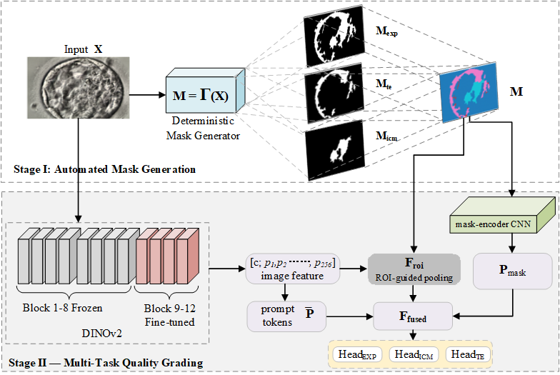

# BM-DINO

Annotation‑Free Mask‑Guided Transformer for Real‑Time Multi‑Aspect Blastocyst Grading
## abstract

Accurate blastocyst grading is essential for maximizing single-embryo transfer success in in~vitro fertilization (IVF).
We present BlastocystMask-DINO (BM-DINO), a two-stage framework. 
In Stage I, a deterministic mask generator produces four-class masks from raw day-5 microscopy images at zero labeling cost. 
In Stage II, these masks drive a parameter-free Region of Interest (ROI)-guided pooling and  
are also processed by a mask-encoder CNN to extract structural priors.
Therefore, prompt tokens, ROI-guided features, and mask-derived structural priors are fused additively to integrate global context, local focus, and morphological cues. 
Particularly, we leverage pretrained DINOv2, an unsupervised vision transformer, as the backbone and fine-tune the last four blocks to adapt the model efficiently to blastocyst grading. 
When evaluated on the public Human Blastocyst Dataset (HBD), BM-DINO achieves macro-F1 scores of 0.79 for expansion (EXP), 0.80 for inner cell mass (ICM), and 0.73 for trophectoderm (TE).
Our model exceeds expert consensus by 6% on ICM and 2% on TE, achieving state-of-the-art performance. Also, it outperforms prior works in delivering the most balanced performance across all grading tasks. 
The entire approach adds only 0.07 M trainable parameters and runs end-to-end in ~ 0.24 s on commodity hardware (233~ms CPU + 8~ms GPU), making the system suitable for real-time deployment in IVF laboratory.

## Environment
PyTorch: 2.0\
Cuda: 11.8\
Python: 3.8

## runs
### step1
`python Mask-generation.py`

### step2
`python BM-DINO.py`